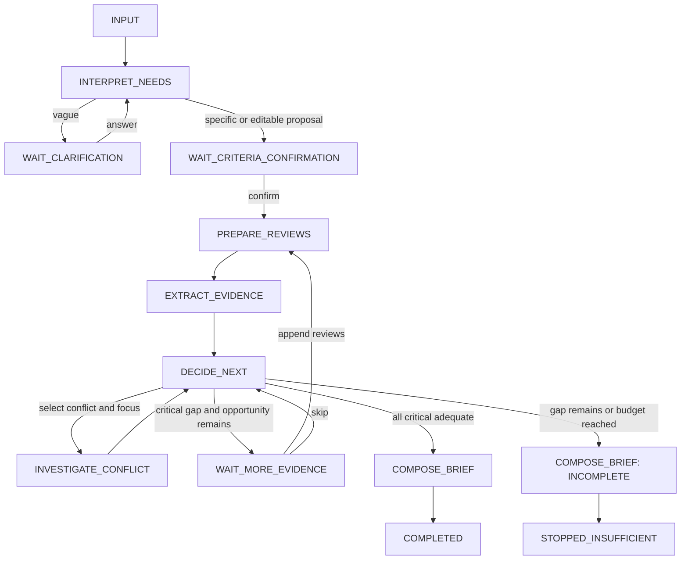

# BuyLens — 状态机与决策策略

> 2026-10-01 implementation update: Core direction approved. IMPLEMENTATION_PLAN.md supersedes the original engineering details below. Initial implementation uses Next.js/TypeScript/Vercel + one Supabase sessions JSONB table; one clarification round, one evidence request, one investigation per conflict/version, five decision iterations; exact/normalized duplicates; reviewId + exact quote verified with includes; four lightweight activity kinds. Six priority tests are release gates; the other original cases are backlog. Browser demo persistence is explicitly localStorage until cloud credentials are configured. The initial UI supports the two confirmed headphone criteria.

状态：待审核的完整执行设计。只用一个 Agent；未实现。字段与工具契约分别见 DATA_MODEL、TOOL_SPEC。

## 角色边界
- **LLM 推理：**把需求转成标准、找出澄清问题；提取语义/使用情境/正反体验；解释冲突；根据当前状态提出下一个动作及目标；组织简报。
- **确定性控制器：**输入和 schema 校验、确认门、原文定位、重复组计数、覆盖规则、合法动作集合、预算、持久化、幂等、超时与错误恢复。不能由模型更改这些规则。
- **工具：**prepare_reviews、extract_evidence、investigate_conflict、compose_brief。服务端函数实际执行，不是生成工具名称文本。
- **人：**提供输入、回答必要问题、确认/编辑标准、选择补充材料或跳过、查看结果并作购买决定。最终阅读无需额外审批按钮。

## 主路径与分支

## 每个状态的执行契约
工具栏“模型响应”不是伪造第五个工具；其请求也计入预算。每次状态转换及工具完成都先保存，再通知 UI。

| 状态 | 输入 | Agent 决策 | 可到达状态 | 工具/机制 | 状态更新 | 用户交互 | 失败行为 |
|---|---|---|---|---|---|---|---|
| INPUT | 单商品、需求、评论草稿 | 控制器检查格式/上限，是否能启动 | INTERPRET_NEEDS、INPUT | 确定性输入校验 | 存 product/rawNeeds/草稿、版本 | 提交或加载示例；更换商品开新会话 | 空值/超限留 INPUT，精确指出错误，不调用模型 |
| INTERPRET_NEEDS | rawNeeds、澄清答案、已有候选标准 | 模型判断是否可形成可操作标准，选择最关键的一个问题 | WAIT_CLARIFICATION、WAIT_CRITERIA_CONFIRMATION、ERROR_RECOVERABLE | 结构化模型响应 | 候选 criteria、pendingQuestion；增加 modelCalls | 展示可编辑候选；说明两小时为建议 | 一次格式修复后失败进错误；不自确认 |
| WAIT_CLARIFICATION | 一个具体问题、已有答案次数 | 用户回答后重解析；跳过/已回答两次则给可编辑候选 | INTERPRET_NEEDS、WAIT_CRITERIA_CONFIRMATION | 用户动作/控制器 | clarificationAnswers、补充需求、事件 | 一次问一个问题，可跳过；未明确处候选标 PROPOSED | 空答提示；不循环追问；缺关键场景时禁止确认 |
| WAIT_CRITERIA_CONFIRMATION | 最多四项候选标准、优先级与情境 | 用户确认；控制器检查至少一个 Critical 且关键情境可操作 | PREPARE_REVIEWS、WAIT_CRITERIA_CONFIRMATION、INPUT | 用户确认/编辑 | 确认版本；编辑递增 criteriaVersion 并清除派生结果 | Confirm/Edit；可返回改输入 | 不能用沉默代表确认；缺必需情境则在此编辑 |
| PREPARE_REVIEWS | 已确认标准、提交/追加的评论 | 固定先规范化；无语义推断 | EXTRACT_EVIDENCE、INPUT、ERROR_RECOVERABLE | prepare_reviews | 原文 ID、重复组；增加 toolCalls | 预览分条来源；运行时显示实际结果 | 格式错误返回 INPUT，保留标准；存储失败进错误 |
| EXTRACT_EVIDENCE | 全部 Review、已确认 Criterion | 模型抽取相关正反证据；控制器验证与覆盖计算 | DECIDE_NEXT、ERROR_RECOVERABLE | extract_evidence | evidence/assessments/conflicts/unknowns 全量替换、计数 | 进度和当前缺口可见 | 无相关证据仍是成功；坏引用不提交；工具异常进错误 |
| DECIDE_NEXT | 当前覆盖、冲突、未知、预算 | 模型从合法集合选动作/目标/简短理由 | INVESTIGATE_CONFLICT、WAIT_MORE_EVIDENCE、COMPOSE_BRIEF、ERROR_RECOVERABLE | 结构化 ActionDecision | 存 decision 与 allowedActions；计数/事件 | 展示“调查舒适度冲突”等事实理由 | 非法动作允许一次修复；仍失败则控制器按缺口保守停止并标 source=CONTROLLER |
| INVESTIGATE_CONFLICT | 一个 OPEN 冲突与 focus | 模型比较有引文支持的情境差异，不能补造信息 | DECIDE_NEXT、ERROR_RECOVERABLE | investigate_conflict | findings、冲突状态、unknowns、重算覆盖；conflictCalls +1 | 展示情境差异及尚未解释部分 | 无解释→UNRESOLVED，不作为异常；不能反复调查同一版本 |
| WAIT_MORE_EVIDENCE | Critical 缺口与一个具体材料请求 | 用户补充则重新分析；跳过则不足停止 | PREPARE_REVIEWS、DECIDE_NEXT、WAIT_MORE_EVIDENCE | 用户动作/控制器 | evidenceRequests +1；回复存事件；追加时 inputVersion +1，brief 失效 | 提示“需要地铁实际使用评论”，提供追加/跳过 | 不联网找证据；非法追加留此页且不消耗第二次机会；等待期间不调用模型 |
| COMPOSE_BRIEF | 已验证状态、完整/不足 mode | 组织简报并验证引用；mode 由控制器限制 | COMPLETED、STOPPED_INSUFFICIENT、ERROR_RECOVERABLE | compose_brief；必要时确定性降级模板 | 存 brief 与终止原因、版本 | 看结果、点击原文；无需再审批 | 失败不能显示未校验输出；可重试或展示标明降级的已验证清单 |
| COMPLETED | COMPLETE_WITH_CAVEATS 简报 | 自动工作结束；用户购买决定在系统外 | COMPLETED、WAIT_CRITERIA_CONFIRMATION、PREPARE_REVIEWS、INPUT | 读取快照/用户动作 | 无自动更新；编辑/追加使简报失效 | 查引用；编辑标准；若补充机会未用可追加 | 旧结果标过期，不能用于新版本；不能声称保证适合 |
| STOPPED_INSUFFICIENT | INCOMPLETE 简报/降级清单、明确原因 | 自动工作停止，保留未知项 | STOPPED_INSUFFICIENT、WAIT_CRITERIA_CONFIRMATION、PREPARE_REVIEWS、INPUT | 读取快照/用户动作 | 保留停止原因 | 读缺口；若唯一补充机会已用，额外材料须开新任务 | 不自动重试/循环，不输出充分性假象 |
| ERROR_RECOVERABLE | 有效快照、错误与 resumeState | 用户可重试一次失败操作，或结束 | resumeState、STOPPED_INSUFFICIENT、ERROR_TERMINAL | 幂等重试/降级模板 | error、operationId、重试事件；计数不回退 | Retry/结束；解释已保存进度 | 预算不足拒绝重试并停止；存储失败不能声称进度已保存 |
| ERROR_TERMINAL | 无法读取/写入快照或不兼容 schema | 停止，不能从损坏数据推断结果 | ERROR_TERMINAL、INPUT | 控制器诊断 | 只在存储可用时写错误 | 明确提示开始新任务；保留原文件供诊断 | 不覆盖损坏文件、不冒充恢复成功 |

INPUT 页编辑非商品字段时使旧派生数据失效，改变需求必须重新确认。所有非终态允许用户“结束任务”：若有有效证据则走不足模式/降级清单；无有效证据只显示终止原因，STOPPED_INSUFFICIENT。人类等待不会被超时解释为批准。模型/工具超时才进入错误状态。

## 证据质量、相关性、覆盖与置信度
这些是**可解释的工程规则**，不是统计验证结果或评论真实性判断。

1. 信息价值由模型按 rubric 解释：LOW＝仅“不错/已收到”或无实际使用细节；MEDIUM＝具体体验且至少一个使用情境/时长；HIGH＝具体体验同时包含与标准相关的情境、时长或限制条件。长文章不自动高质量，长拥有时间不自动代表长时佩戴。
2. 重复/模板化标记由工具给出。一组只能贡献一个支持单位；同一已知作者的多条同向证据也合并计数。重复不是造假，不删除原文。
3. 星级与文字矛盾保留 flag；判断 polarity 看文字。负面文字不得被五星覆盖；矛盾使置信度最高为 MEDIUM，不抹除细节。
4. DIRECT 必须满足标准实际用途：长时舒适度需有达到确认时长的佩戴体验；地铁 ANC 需明确地铁环境及目标噪声体验。办公室、短时佩戴、其他明确型号只是 PARTIAL/NONE。缺版本不得补造版本，明确版本不匹配不算直接覆盖。
5. Critical 的 ADEQUATE 门槛：至少两个不同支持单位的 DIRECT 证据（正或反都计入覆盖），information ≥MEDIUM，且至少一条 HIGH；没有 OPEN/UNRESOLVED 冲突。全部为负面也可充分：足够的是理解风险的依据，不是购买支持。
6. 满足数量但冲突尚未解释＝MIXED；数量/情境不足＝INSUFFICIENT。有差异证据可 CONTEXT_EXPLAINED，保留个人相关风险；不把关联说成因果，也不借解释自动替用户决定哪种体验适用。
7. 非 Critical 不阻断合成，仍显示缺口。HIGH 置信度要求 ADEQUATE、至少两条 HIGH DIRECT、无星级矛盾；其他 ADEQUATE 为 MEDIUM，MIXED/INSUFFICIENT 为 LOW。HIGH 也必须附“仅基于所提供材料，无法保证个人体验”。

“两个支持单位”是独立文字组的近似，不证明真实独立评论者，不做群体比例、因果与真实性推断。

## DECIDE_NEXT 的合法动作与自主性
控制器根据状态构造 allowedActions，模型确实选择动作和 targetIds，不是被要求输出固定下一步：
- 有 OPEN 冲突且尚有调查预算 → 可 INVESTIGATE_CONFLICT；模型选择冲突和 focus，优先 Critical。
- 有 Critical 缺口且尚未请求过补充 → 可 REQUEST_EVIDENCE；模型选择最能影响判断的一项缺口，给单次具体请求。若材料无法获得或预算不足也可 STOP_INSUFFICIENT。
- 所有 Critical 为 ADEQUATE → 可 FINALIZE；非关键冲突可选择调查，但不得因此无限延迟。
- 仍有关键缺口且用户已跳过/补充机会耗尽，或模型/工具预算耗尽 → 仅可 STOP_INSUFFICIENT。
- Critical OPEN 冲突时不能 FINALIZE；无相关未知时不得 REQUEST_EVIDENCE；同冲突同版本不能重复调查。

例如 Comfort 冲突和 Subway 缺口同时存在，模型可先调查舒适度或先请求地铁证据；两者是不同合法下一步。最终只在充分条件满足时完整合成。保守控制器兜底须明示，不能把固定兜底宣称成模型自主选择。

## 预算、停止与恢复
- 每输入/标准版本最多 10 次模型请求（工具内、修复、失败请求均计入）、8 次工具执行、2 次冲突调查；单会话最多 2 次澄清回答、1 次补充证据机会、60 个事件。
- 每个模型请求目标超时 20 秒；单次活动运行段总上限 120 秒。等待用户期间不计活动时间、不轮询调用模型。工具不得自动连续重试。
- 冲突每版本只调查一次；调查后必须改变 conflict.status 或新增有效 finding/unknown，否则标 UNRESOLVED，无进展不继续。
- 到预算上限时用确定性模板停止，保留已校验证据和未知；不会额外越预算请求模型“总结”。
- 保存失败进入错误；引用失败一次修复后仍失败不展示；API 失效保留进度，可手动重试一次；无评论输入在输入页阻断。
- 重试使用同 operationId，预算不回退；恢复后成功的工具不重复执行。补充新版本重新计算所有证据，但保持用户已确认标准。

## 最终结果的含义
COMPLETED 表示“已按本 MVP 的证据规则完成简报”，不是“建议购买”。STOPPED_INSUFFICIENT 表示“关键问题仍没有足够依据，自动分析已停止”，仍可显示不完整简报。两种终点均能包含风险、反证和购买前确认事项，不使用 BUY/DON'T BUY 分数。
