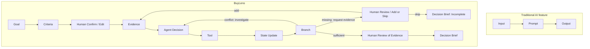

# BuyLens — 未来作品集叙述草稿

> 2026-10-01 implementation update: Core direction approved. IMPLEMENTATION_PLAN.md supersedes the original engineering details below. Initial implementation uses Next.js/TypeScript/Vercel + one Supabase sessions JSONB table; one clarification round, one evidence request, one investigation per conflict/version, five decision iterations; exact/normalized duplicates; reviewId + exact quote verified with includes; four lightweight activity kinds. Six priority tests are release gates; the other original cases are backlog. Browser demo persistence is explicitly localStorage until cloud credentials are configured. The initial UI supports the two confirmed headphone criteria.

状态：**未实现的叙述框架**。以下描述的是计划，发布时必须改成实际完成范围，填入真实验证记录；不能把计划中的表现当作成果。

## Problem：购买前的个人问题
一位学生每天地铁通勤约一小时，也常在图书馆长时间戴耳机。已经看中一款头戴式降噪耳机，却仍担心两件事：长时间夹头或耳痛，以及地铁中的实际降噪效果。大量评论提供很多意见，但这些意见来自不同情境，并不自动回答这个学生的问题。

## Why existing summaries are insufficient：摘要之后还缺什么
本项目要验证的假设是：普遍反馈摘要可以减少阅读量，却未必替用户检查特定标准的证据缺口。例如“降噪很好”缺少环境，“戴了半年”缺少单次时长，“很舒服”可能只有十分钟体验。通用聊天工具也可能完成这些判断，因此 BuyLens 的差异不靠身份宣言，而靠可验证的确认、追溯和下一步行为。

不宣称已证明所有平台摘要都有问题；没有竞品测试时只说“针对这一任务设计的假设”。

## Why Agent：证据改变操作
当评论足够相关时，Agent 可以合成结果；当舒适度相互矛盾时，它先调查佩戴时长和眼镜等有原文依据的差异；当评论只涉及办公室降噪时，它请求地铁证据；用户跳过后，它明确停止，而不是为了填满报告猜测。

真正的展示重点是：**同一个商品，换一组证据，下一步工具和最终状态随之改变。** 不将多次模型调用或一段“正在思考”动画当作 Agent 证明。

## Agent architecture：一个控制循环，四个工具

图中的 Human Review of Evidence 是阅读/检查，不是额外审批门；系统不等待最终报告审批才生成。唯一必需确认门是 Criteria Confirm/Edit；补充或跳过是缺口时的用户选择。

模型负责语义、冲突解释与下一步提议；控制器负责确认门、引用、重复计数、覆盖规则、预算与版本。四工具：prepare_reviews、extract_evidence、investigate_conflict、compose_brief。每次结果落盘，下一次决策读取最新状态。没有多 Agent 或复杂 RAG。

## Human-in-the-loop：确认什么，为什么
模型先把自然语言转为两项 Critical 标准。用户可改优先级和单次佩戴时长，“两小时”只是提议。只有明确确认后才分析；编辑会使旧证据与结果失效，防止模型围绕错误目标继续运行。没有加审批按钮来凑流程。

## Failure handling：不确定不是异常掩饰
证据不足是正常终点：显示未知、缺少的材料和购买前应确认的事项。API 超时是运行错误：保存可恢复状态并给一次重试。引用无效是不合格输出：拒绝展示并尝试一次修复。预算耗尽时停止并展示明确降级的证据清单。

“文字有细节”“评论重复”“五星却抱怨疼痛”都不能证明真伪。置信标签只描述当前材料的相关覆盖，不能等价于真实性概率或个人佩戴保证。

## Demo：计划三分钟演示脚本
| 时间 | 展示 | 要证明的行为 |
|---|---|---|
| 0:00–0:30 | 学生需求、单个 Demo-H1、标准编辑/确认 | 用户目标不是由模型暗自决定 |
| 0:30–1:20 | 基线证据、舒适度冲突调查、原文定位 | 真实工具选择，情境解释仍保留反证 |
| 1:20–2:10 | 缺口输入仅有办公室 ANC；请求地铁材料，跳过后停止 | 不同证据改变路径，关键不足不会被漂亮报告掩盖 |
| 2:10–2:45 | 另一次缺口任务追加地铁材料、刷新恢复 | 状态保留，新证据改变后续判断 |
| 2:45–3:00 | 七项简报与评估/限制 | 用户可以指出风险和未知，系统不替用户下单 |

数据必须明确标合成。剪辑压缩模型等待时应说明；录像不代替现场可运行检查。不展示假工具调用，不把预生成报告说成实时结果。

## Evaluation：未来该报告哪些证据
- 在 T01–T20 中列实际通过/失败/未运行数量，区分 stub 和真实模型。
- 展示至少三种实际工具序列，以及一次模型选冲突目标与一次不足停止事件。
- 对测试集合计算重要产品判断的引用有效率、Critical 缺口披露率；目标均 100%，发布时填实际数。
- 记录实际延迟、模型调用次数和预算耗尽案例，不编造性能成绩。
- 刷新、编辑、补充、失败重试的真实浏览器截图/日志。
- 一次非设计参与者试用：能否指出一项个人风险及一项未知。样本量小，只作为可用性反馈。

## Limitations：必须保留在发布版
只支持一个耳机购买场景；输入依赖用户提供，不验证样本代表性和真实身份；重复组只能近似独立文字；覆盖门槛未经过统计校准；评论无法保证个人舒适度；没有实时平台获取与实测 ANC；单实例会话存储不是生产级多租户系统。

若部署、live 模型或某分支未完成，明确披露未完成项目。最终作品集标题可以是“BuyLens：根据个人购买标准调查评论证据的 Agent”，不要写“识别假评论、准确预测是否值得买”。
